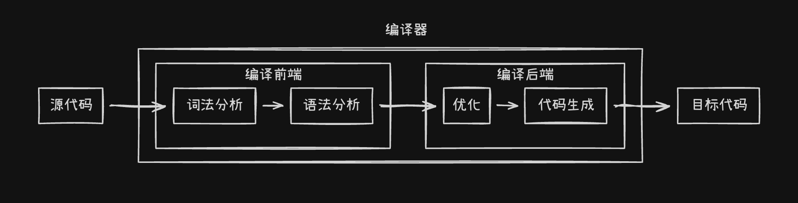
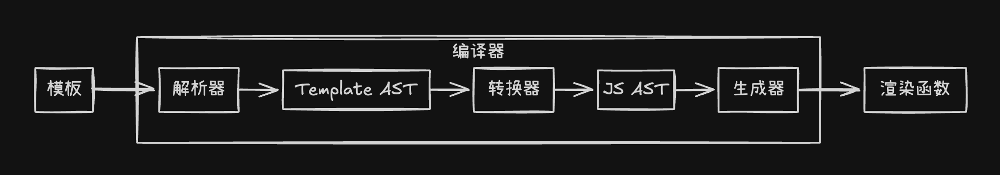
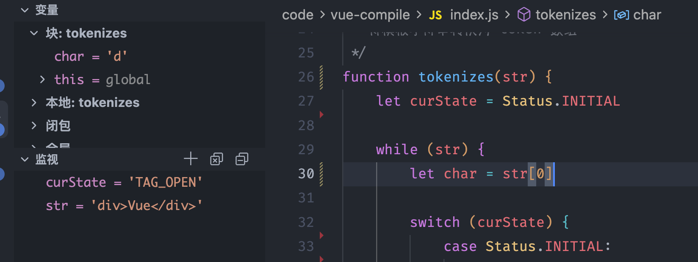
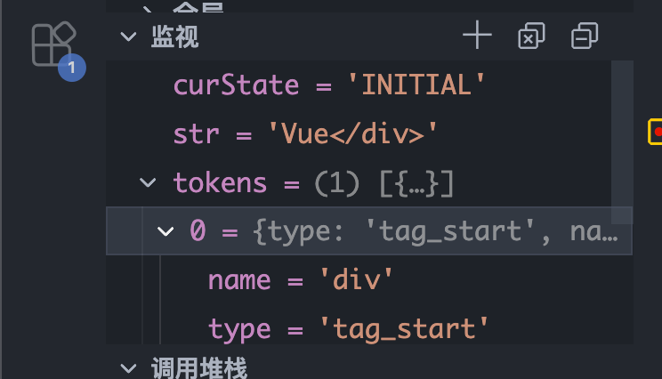
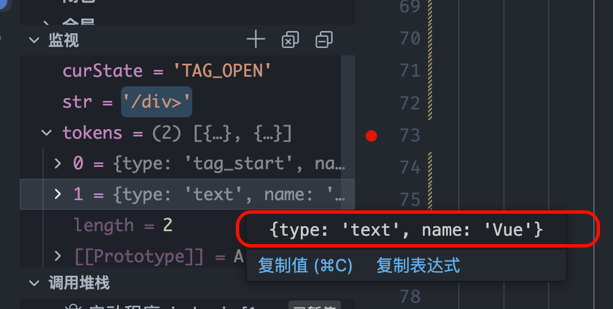
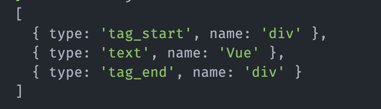
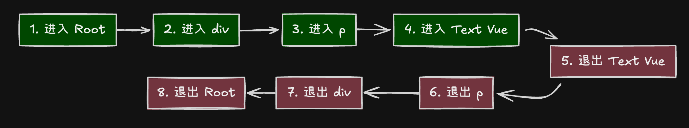

# Vue 编译原理

> 参考: 《Vue.js设计与实现》 -- 霍春阳

> 声明：本文是基于个人学习和理解所写，如有理解偏差或错误之处，还请各位读者指出。

## 什么是编译？

提到编译，相信不少读者都会觉得是一件很神秘的事情，本文就通过分析 Vue 的编译原理，来掀开它的神秘面纱。

什么是**编译（compile）**呢？在 Vue 中，我们通常说的编译就是指将模板中的代码转为可用的 render 函数，也就是将 html 代码转为了 js 代码。所以我们可以理解编译就是将一种语言 ==转变==> 另一种语言。而这个被转变的就称之为源码（source code），转变后得到的结果，就称之为目标代码（target code）。

而一个语言要转变为一种新的语言，我们要通过什么手段呢？粗暴的关键词映射或者字符串替换吗？在编程中，虽然不可避免的存在硬编码，但是我们一定会通过各种手段来进行优化，让硬编码尽可能的少，而这两个方法，很明显，就是一种非常糟糕的硬编码。

设想一下，如果把一段中文翻译为英文，如果直接按照词语的顺序直翻，那么不少时候，一段句子的语义可能都是显得比较奇怪的。所以通常不会逐字替换，而是会先理解这段话的意思和结构：哪些是主语、哪些是谓语、哪些是修饰成分。然后再用英文的语法规则重新组织这些内容。

编译也是同样的道理。我们需要一个"中间形式"来表达源码的结构和语义，这个中间形式就是 **抽象语法树（Abstract Syntax Tree，简称 AST）**。

实际上，在计算机科学中，编译过程通常被分为几个关键步骤：
1. **词法分析**：将代码字符串分解成一个个有意义的词法单元（token）
2. **语法分析**：将这些词法单元组织成一个树形结构，这个结构就是 **抽象语法树（Abstract Syntax Tree，简称 AST）**
3. 中间代码生成、优化...（有些编译过程会有这些步骤）
4. **代码生成**：基于 AST 生成目标代码

可以看到，AST 在编译过程中扮演着承上启下的关键角色，它就像一座桥梁，连接着源码和目标代码。

如果对上面的步骤进行一些拆分，那么大致可以分为两个部分，编译前端和编译后端：

- 编译前端: 通常与目标平台无关，仅负责分析源码。
- 编译后端: 通常与目标平台相关，负责生成能够运行的平台代码。



## 什么是 AST？

前面我们多次提到了 AST（抽象语法树），但它到底长什么样呢？为什么要叫"树"，又为什么要叫"抽象"？

首先，让我们通过一个简单的例子来理解什么是"树"。假设我们有这样一个简单的算术表达式：

```
2 + 3 * 4
```

我们都知道，这个表达式的计算结果是 `14`，而不是 `20`，因为乘法的优先级高于加法。那么在程序中，我们如何表达这种优先级关系呢？答案就是用**树形结构**：

```
        +
       / \
      2   *
         / \
        3   4
```

可以看到，这个树形结构清晰地表达了运算的优先级：先计算 `3 * 4`，再将结果与 `2` 相加。这就是为什么叫"树"——它用**层级关系**来表达代码的**结构和优先级**。

那为什么又叫"抽象"呢？因为这棵树只保留了代码的核心结构和语义，而**省略了一些语法细节**。比如在上面的树中，我们看不到空格、看不到表达式从左往右的书写顺序，只保留了最核心的信息：有两个操作符（`+` 和 `*`），三个操作数（`2`、`3`、`4`），以及它们之间的层级关系。

在实际的编程中，AST 通常用对象来表示。上面的算术表达式对应的 AST 可能是这样的：

```js
{
  type: 'BinaryExpression',    // 二元表达式
  operator: '+',
  left: {
    type: 'Literal',           // 字面量
    value: 2
  },
  right: {
    type: 'BinaryExpression',
    operator: '*',
    left: {
      type: 'Literal',
      value: 3
    },
    right: {
      type: 'Literal',
      value: 4
    }
  }
}
```

可以看到，每个 AST 节点都包含了几个关键信息：
- **type（类型）**：这个节点是什么类型的语法结构（表达式、语句、字面量等）
- **属性**：这个节点的具体信息（比如操作符是 `+` 还是 `-`，字面量的值是多少）
- **子节点**：这个节点包含的子结构（比如二元表达式的左右操作数）

正是通过这种树形结构，编译器可以方便地遍历、分析和转换代码。比如要计算上面的表达式，只需要递归地计算子节点，然后根据操作符进行运算即可。

那么在 Vue 中，模板对应的 AST 又是什么样的呢？让我们接着往下看。

## 了解 Vue 编译流程
经过前文的解析，相信你对编译已经有了一些大概的理解，而 Vue 的模板编译也正是遵循了这样的流程。

回到文章开头提到的，Vue 的编译就是将模板（Template）转换为渲染函数（Render Function）。那么这个过程具体是如何进行的呢？让我们将前面学到的编译知识应用到 Vue 中：

举个例子，我们有这样一个 Vue 模板：

```vue
<div id="app">
  <p>{{ message }}</p>
</div>
```

Vue 最终会将它转换成类似这样的渲染函数：

```js
function render() {
  return _c('div', { attrs: { id: 'app' } }, [
    _c('p', [_v(_s(message))])
  ])
}
```

而变成这样大概会经过如下几个步骤，如图：



而这种步骤也在其它地方有所体现，比如 typescript --> javascript。那肯定大概流程就是 typescript --> typescript AST --> javascript AST --> javascript。当然，这种例子还有很多，就不一一列举了。

## Template --> Template AST

### 实现分析

> 编译的思想虽然都差不多，但是落到具体的实现，又各有不同，所以此小节，将会对 vue 中如将 templete 编译为 render 函数做出简要的介绍。

通过上面的赘述，不难猜到解析器的核心作用就是将模板代码变为 AST。 假设我们有下面一段模板代码:
```vue
<template>
    <div>
        <h1 :class="titleClass">Hello World</h1>
    </div>
</template>
```

上面这段代码，从我们看来，可能会有变量、标签、字符...的存在，而对于解析起来说，就是一段源码字符串，使用代码简单表示，如下:
```js
const sourceCode = `<template><div><h1 :class="titleClass">Hello World</h1></div></template>`
```

那么如何解析呢？如果你看过霍春阳大佬的《Vue.js 设计与实现》这本书，那么相信你一定不陌生。在这本里面，提出了一个概念**有限状态自动机**。

那么什么是有限状态自动机呢？有限状态自动机（Finite State Automaton，也称有限状态机）听起来好像很高大上，理解起来并不困难，"有限状态"指的是状态是有限的，"自动机"意味着随着字符的输入，解析器会自动地在不同状态间迁移。它的核心思想非常简单：**一个系统在任意时刻都处于某个特定的"状态"，当接收到不同的"输入"时，会"自动"转移到另一个"状态"**。这里的"自动"指的是状态转移是确定性的，遵循预先定义好的规则。

举个生活中的例子，想象一下你在使用一个简单的电灯开关：
- **初始状态**：灯是关闭的
- **输入**：按一下开关 → **状态转移** → 灯打开了
- **再输入**：再按一下开关 → **状态转移** → 灯关闭了

这个电灯系统就是一个简单的有限状态机，它只有两个状态（开/关），通过特定的输入（按开关）来切换状态。

那么在解析 HTML 模板时，有限状态机是如何工作的呢？我们可以把解析器想象成一个"读字符"的机器，它会从左往右逐个字符地读取模板字符串，根据当前读到的字符，来判断自己处于什么状态，然后决定下一步该做什么。

比如解析 `<div>Hello</div>` 这段代码时，解析器可能会经历这样的状态变化：

1. **"初始状态"** → 读到 `<` → 进入 **"标签开始"状态**
2. **"标签开始"状态** → 读到字母 `d` → 进入 **"标签名"状态**
3. **"标签名"状态** → 继续读到 `i`、`v`，拼接成标签名 `div`
4. **"标签名"状态** → 读到 `>` → **开始标签解析完成**，创建一个 `<div>` 元素节点，进入 **"文本内容"状态**
5. **"文本内容"状态** → 读到 `H`、`e`、`l`、`l`、`o`，拼接成文本内容 `Hello`
6. **"文本内容"状态** → 读到 `<` → 文本内容收集完成，进入 **"标签开始"状态**
7. **"标签开始"状态** → 读到 `/` → 判断这是一个结束标签，进入 **"结束标签名"状态**
8. **"结束标签名"状态** → 读到 `d`、`i`、`v` → 拼接成结束标签名 `div`
9. **"结束标签名"状态** → 读到 `>` → **结束标签解析完成**，与之前的开始标签 `<div>` 配对，完成该元素的解析

我们可以用一个简化的状态转换图来表示：

```
初始状态
   ↓ (读到 '<')
标签开始
   ↓ (读到字母)
标签名 (收集 "div")
   ↓ (读到 '>')
文本内容 (收集 "Hello")
   ↓ (读到 '<')
标签开始
   ↓ (读到 '/')
结束标签名 (收集 "div")
   ↓ (读到 '>')
完成解析
```

通过这种方式，解析器可以**精确地识别**模板中的每一个部分：哪些是开始标签、哪些是属性、哪些是文本内容、哪些是结束标签。而且，这种方法不需要复杂的正则表达式，也不需要回溯，只需要顺序读取字符，根据当前状态做出相应的处理即可，**效率非常高**。

### 具体实现-前置准备

> 这一步骤做的事情很简单，做好一些准备工作，定义要解析的模板字符代码，状态映射字段，判断字母的辅助函数

那么我们可以根据这个来进行一个最简实现，既然是通过状态来确定，就必须先定义好状态，如下：

```js
const template = `<div>Vue</div>` // 假设这就是模板代码

const Status = {
    /**初始状态 */
    INITIAL: 'INITIAL',
    /**标签开始状态 */
    TAG_OPEN: 'TAG_OPEN',
    /**标签名状态 */
    TAG_NAME: 'TAG_NAME',
    /**标签结束名状态 */
    TAG_CLOSE_NAME: 'TAG_CLOSE_NAME',
    /**文本状态 */
    TEXT: 'TEXT'
}

/**
 * 判断是否是字母
 */
function isAlpha(char) {
    return char.match(/[a-zA-Z]/)
}
```

### 具体实现-词法分析

> 经过此小节，模板代码会从一段字符，变为一个 tokens 数组。

编译第一步，词法分析，就是把这源代码拆分为最小单元，因此我们可以写出这个函数的函数签名，如下：

```js
function tokenizes(str){
    const tokens = []
    
    switch (curState) {       
        case Status.INITIAL: // 初始状态
            break  
        case Status.TAG_OPEN: // 标签开始状态
            break
        case Status.TAG_NAME: // 标签名状态
            break
        case Status.TEXT: // 文本状态
            break
        case Status.TAG_CLOSE_NAME: // 标签结束名状态
            break
    }
    
    return tokens
} 
```

根据前文的分析，我们可以知道：

1. 最开始的状态为`初始状态`，
2. 如果是初始状态的情况下，若碰到 `<` 字符则会表示为是`标签开始状态`，
3. 且这个字符经过判定之后，就无用了，所以就要把这个**字符切除**，然后进入下一个字符的判定
4. 那么如果不是碰到 <，而是一个字母呢？ 那么就表示进入一个文本状态。 
5. 文本状态下就是持续的收集字符，等待 < 的出现。

所以代码如下：

```js
/**
 * 将模板字符串转换为 token 数组
 */
function tokenizes(str) {
    let curState = Status.INITIAL // 定义初始状态
    
    const tokens = []

    while (str) {
        let char = str[0] // 提取当前字符

        switch (curState) {
            case Status.INITIAL:
                // 如果当前字符是 <，则表示需要进入 [标签开始状态]
                if (char === '<') {
                    curState = Status.TAG_OPEN
                    str = str.slice(1)
                } 
            		// 否则进入[文本状态]
            		else if (isAlpha(char)) {
                    curState = Status.TEXT
                }
                break
            case Status.TAG_OPEN:
                break
            case Status.TAG_NAME:
                break
            case Status.TEXT:
                break
            case Status.TAG_CLOSE_NAME:
                break
        }
    }
  
    return tokens
}
```

经过这一步骤之后，我们可以查看一下当前的各项值，如图：



那么继续进行下一个字符 d 的解读：

1. `标签开始状态`下如果遇到了一个**字母**，则会切换到`标签名状态`，但是这一步只会切换状态，并不会切除字符 
2. 而标签名状态下，如果遇到字母则会进行收集
3. 直到遇到 `>` 字符，才会结束标签开始状态，然后又回归`初始状态`
4. 然后记录本次得到 token，并清空本次存储字符的容器

所以代码如下：

```js
function tokenizes(str) {
    let curState = Status.INITIAL

    const tokens = []

    // 因为要收集字符，所以需要一个变量来存储当前收集的字符
    const chars = []

    while (str) {
        let char = str[0]

        switch (curState) {
            case Status.INITIAL:
                if (char === '<') {
                    curState = Status.TAG_OPEN
                    str = str.slice(1)
                }
                break
            case Status.TAG_OPEN:
                // [标签开始状态]下，遇到字母，则表示进入 [标签名状态]
                if (isAlpha(char)) {
                    curState = Status.TAG_NAME
                }
                break
            case Status.TAG_NAME:
                // [标签名状态]下，遇到字母只需要将其存入 chars 中即可
                if (isAlpha(char)) {
                    chars.push(char)
                    str = str.slice(1)
                }
                // 而如果遇到 > 字符，则表示[标签开始状态]结束，则需要回到[初始状态]
                if (char === '>') {
                    curState = Status.INITIAL
                    // 将 chars 转换为字符串，并添加到 tokens 中
                    tokens.push({
                        type: 'tag_start',
                        name: chars.join('')
                    })
                    chars.length = 0 // 清空 chars
                    str = str.slice(1)
                }
                break
            case Status.TEXT:
                break
            case Status.TAG_CLOSE_NAME:
                break
        }
    }
  
    return tokens
} 
```

那么我们可以看下输出是否符合我们的预期，如图：

 

继续解析下一个字符：

1. 现在我们又回到了`初始状态`
2. 初始状态如果没有遇到 <，则会进入文本状态
3. 文本状态要做的事情也很简单，收集字符，直到遇到字符 <，停止收集，生成一个 token，并进入`标签开始状态`

所以代码如下：

```js
function tokenizes(str) {
    let curState = Status.INITIAL

    const tokens = []

    const chars = []

    while (str) {
        let char = str[0]

        switch (curState) {
            case Status.INITIAL:
                if (char === '<') {
                    curState = Status.TAG_OPEN
                    str = str.slice(1)
                } else if (isAlpha(char)) {
                    curState = Status.TEXT
                }
                break
            case Status.TAG_OPEN:
                if (isAlpha(char)) {
                    curState = Status.TAG_NAME
                }
                break
            case Status.TAG_NAME:
                if (isAlpha(char)) {
                    chars.push(char)
                    str = str.slice(1)
                }
                if (char === '>') {
                    curState = Status.INITIAL
                    tokens.push({
                        type: 'tag_start',
                        name: chars.join('')
                    })
                    str = str.slice(1)
                    chars.length = 0
                }
                break
            case Status.TEXT:
                if (char === '<') {
                    // 切换到标签开始状态
                    curState = Status.TAG_OPEN
                    tokens.push({
                        type: 'text',
                        name: chars.join('')
                    })
                    chars.length = 0
                    str = str.slice(1)
                } else {
                    // 收集文本
                    chars.push(char)
                    str = str.slice(1)
                }
                break
            case Status.TAG_CLOSE_NAME:
                break
        }
    }

    return tokens
}
```

照例，我们来阅览一下结果，如图：



可以看到，结果是符合预期的。继续处理下一个字符：

1. 现在状态是`开始标签状态`，要处理的字符是 `/`，这个字符则会进入`标签结束名状态`
2. 这种状态也和之前的别无二致，收集字母，直到遇到 >，切换到`初始状态`

因此代码如下：

```js
function tokenizes(str) {
    let curState = Status.INITIAL

    const tokens = []

    const chars = []

    while (str) {
        let char = str[0]

        switch (curState) {
            case Status.INITIAL:
                if (char === '<') {
                    curState = Status.TAG_OPEN
                    str = str.slice(1)
                } else if (isAlpha(char)) {
                    curState = Status.TEXT
                }
                break
            case Status.TAG_OPEN:
                if (isAlpha(char)) {
                    curState = Status.TAG_NAME
                }
                // 进行条件补充
                else if (char === '/') {
                    curState = Status.TAG_CLOSE_NAME
                    str = str.slice(1)
                }
                break
            case Status.TAG_NAME:
                if (isAlpha(char)) {
                    chars.push(char)
                    str = str.slice(1)
                }
                if (char === '>') {
                    curState = Status.INITIAL
                    tokens.push({
                        type: 'tag_start',
                        name: chars.join('')
                    })
                    str = str.slice(1)
                    chars.length = 0
                }
                break
            case Status.TEXT:
                if (char === '<') {
                    curState = Status.TAG_OPEN
                    tokens.push({
                        type: 'text',
                        name: chars.join('')
                    })
                    chars.length = 0
                    str = str.slice(1)
                } else {
                    chars.push(char)
                    str = str.slice(1)
                }
                break
            case Status.TAG_CLOSE_NAME:
                // 如果是字母，则收集
                if (isAlpha(char)) {
                    chars.push(char)
                    str = str.slice(1)
                }
                // 如果是 >，则结束标签结束名状态
                if (char === '>') {
                    curState = Status.INITIAL
                    tokens.push({
                        type: 'tag_end',
                        name: chars.join('')
                    })
                    str = str.slice(1)
                    chars.length = 0
                }
                break
        }
    }

    return tokens
}
```

现在按照预期来说，已经可以得到一整个 toknes 了，结果如图：



ok，至此，词法分析就告一段落了，当然，本文的实现仅仅是最小实现，也不规范，有兴趣自己深度实现一下的，可以自行完善。

### 具体实现-构造 AST

> 经过词法分析，只是得到了最小单元，但是这个最小单元，距离 ast 还有一段路要走，这就是本小节的任务。

回顾一下，经过词法分析后，我们得到了这样一个 tokens 数组：

```js
[
  { type: 'tag_start', name: 'div' },
  { type: 'text', name: 'Vue' },
  { type: 'tag_end', name: 'div' }
]
```

而我们期望得到的 AST 结构应该是这样的：

```js
{
  type: 'Root',
  children: [
    {
      type: 'Element',
      tag: 'div',
      children: [
        {
          type: 'Text',
          content: 'Vue'
        }
      ]
    }
  ]
}
```

可以看到，AST 是一个**树形结构**，而 tokens 是一个**扁平的数组**。那么如何将扁平的数组转换为树形结构呢？

实现的手段不做限制，本文采用的方案是——**栈（Stack）**。

让我们思考一下解析过程：

1. 遇到 `tag_start`（开始标签），创建一个元素节点，然后将其**压入栈中**
2. 遇到 `text`（文本），创建一个文本节点，将其添加到**栈顶元素**的 `children` 中
3. 遇到 `tag_end`（结束标签），将栈顶元素**弹出**

而因为**栈顶元素**始终是"当前正在处理的父元素"。当我们遇到新的子节点时，只需要将其添加到栈顶元素的 `children` 中即可。

让我们用一个简单的例子来演示这个过程，假设我们要解析 `<div><p>Hello</p></div>`：

```
tokens: [
  { type: 'tag_start', name: 'div' },
  { type: 'tag_start', name: 'p' },
  { type: 'text', name: 'Hello' },
  { type: 'tag_end', name: 'p' },
  { type: 'tag_end', name: 'div' }
]

步骤演示：

1. 遇到 <div>  → 创建 div 节点，压入栈 → 栈: [Root, div]
2. 遇到 <p>    → 创建 p 节点，添加到 div.children，压入栈 → 栈: [Root, div, p]
3. 遇到 Hello  → 创建文本节点，添加到 p.children → 栈: [Root, div, p]
4. 遇到 </p>   → 弹出栈顶 p → 栈: [Root, div]
5. 遇到 </div> → 弹出栈顶 div → 栈: [Root]

最终 Root.children 就是完整的 AST
```

当然，文本的分析如果不够明确，就让我们来看一下代码，让我们开始编写代码。首先定义函数签名：

```js
/**
 * 将 tokens 转换为 AST
 */
function parse(tokens) {
    // 创建根节点
    const root = {
        type: 'Root',
        children: []
    }

    return root
}
```

接下来，我们需要一个栈来维护父子关系。**将根节点作为栈的初始元素**，这样就不需要额外判断栈是否为空了：

```js
function parse(tokens) {
    const root = {
        type: 'Root',
        children: []
    }

    // 使用栈来维护父子关系，初始时根节点入栈
    const stack = [root]

    return root
}
```

然后，我们遍历 tokens，根据不同的类型进行处理：

```js
function parse(tokens) {
    const root = {
        type: 'Root',
        children: []
    }

    const stack = [root]

    while (tokens.length) {
        // 取出当前栈顶元素作为父节点
        const parent = stack[stack.length - 1]
        // 取出当前要处理的 token
        const token = tokens[0]

        switch (token.type) {
            case 'tag_start':
                // 遇到开始标签，创建元素节点
                const elementNode = {
                    type: 'Element',
                    tag: token.name,
                    children: []
                }
                // 将元素节点添加到父节点的 children 中
                parent.children.push(elementNode)
                // 将元素节点压入栈中，作为后续节点的父节点
                stack.push(elementNode)
                break
            case 'text':
                // 遇到文本，创建文本节点
                const textNode = {
                    type: 'Text',
                    content: token.name
                }
                // 将文本节点添加到父节点的 children 中
                parent.children.push(textNode)
                break
            case 'tag_end':
                // 遇到结束标签，将栈顶元素弹出
                stack.pop()
                break
        }

        // 处理完当前 token 后，将其移除
        tokens.shift()
    }

    return root
}
```

现在，让我们来测试一下完整的代码：

```js
const template = `<div>Vue</div>`

// 先进行词法分析
const tokens = tokenizes(template)
console.log('tokens:', tokens)

// 再构造 AST
const ast = parse(tokens)
console.log('ast:', JSON.stringify(ast, null, 2))
```

运行后，我们可以得到如下结果：

```js
tokens: [
  { type: 'tag_start', name: 'div' },
  { type: 'text', name: 'Vue' },
  { type: 'tag_end', name: 'div' }
]

ast: {
  "type": "Root",
  "children": [
    {
      "type": "Element",
      "tag": "div",
      "children": [
        {
          "type": "Text",
          "content": "Vue"
        }
      ]
    }
  ]
}
```

可以看到，我们成功地将 tokens 转换为了 AST。它表达了模板的结构：根节点下有一个 `div` 元素，`div` 元素下有一个文本节点 `Vue`。

我们还可以把前文提到的稍微复杂一些的例子，来进行验证：

```js
const template2 = `<div><p>Hello</p></div>`
const tokens2 = tokenizes(template2)
const ast2 = parse(tokens2)
console.log('ast2:', JSON.stringify(ast2, null, 2))
```

输出结果：

```js
{
  "type": "Root",
  "children": [
    {
      "type": "Element",
      "tag": "div",
      "children": [
        {
          "type": "Element",
          "tag": "p",
          "children": [
            {
              "type": "Text",
              "content": "Hello"
            }
          ]
        }
      ]
    }
  ]
}
```

可以看到，也是没有问题的。

至此，我们已经完成了从**模板字符串**到 **AST** 的转换过程。整个过程可以总结为：

1. **词法分析**：将模板字符串拆分为 tokens 数组
2. **语法分析**：利用栈结构，将 tokens 数组转换为树形的 AST

当然，这只是一个最简实现，真正的 Vue 编译器还需要处理更多的情况，比如：属性解析、指令处理、插值表达式、自闭合标签等等。但核心思想是一致的，有兴趣的读者可以自行扩展。

## 转换器：Template AST --> JS AST

> 为什么需要 ast 转 ast 呢？因为渲染函数是由 js 代码来描述的，所以需要转换。

### 具体实现-前置准备

既然是转化，那么我们要做到的第一件事就是能够对**每一个节点**都进行访问，然后才能对每个节点进行转换。这里我们借鉴文章开头书中的示例，在编写这个转换器之前，实现一个打印的方法，方便我们进行观测，如下：

```js
const templateAST = parse(template)

function dump(node, indent = 0) {
    const hyphens = '-'.repeat(indent)
    const tag = node.tag || node.content || ''
    console.log(hyphens + node.type + ': ' + tag)

    if (node.children && node.children.length) {
        node.children.forEach(child => dump(child, indent + 2))
    }
}

dump(templateAST)
```

我们可以查看一下输出，如下：

```
Root:
--Element: div
----Element: p
------Text: Vue
```

有了这个辅助函数之后，就可以比较清晰的看到这些 ast 的节点了。

### 具体实现-节点遍历

现在我们需要的就是一个可以对 ast 每个节点进行遍历的函数，并实现一个功能，将 p 标签替换为 h1 标签，如下：
```js
function traverseNode(node) {
    const currentNode = node

    if (currentNode.type === 'Element' && currentNode.tag === 'p') {
        currentNode.tag = 'h1'
    }

    if (node.children && node.children.length) {
        for (let i = 0; i < node.children.length; i++) {
            const child = node.children[i]
            traverseNode(child)
        }
    }
}

const templateAST = parse(template)

traverseNode(templateAST)

dump(templateAST)
```

输出如下：

```
Root: 
--Element: div
----Element: h1
------Text: Vue
```

### 具体实现-节点转换

当然，真实的转换过程可能不能和我们这样一样的粗暴且不讲道理，这样随着后续的转换逻辑增加，必然导致我们写出的代码成为一座“屎山”。而这种判断可以预见，是多种多样的，比如处理标签、处理文本、处理属性...等等。所以这个外部传入处理器应该是多个的，代码如下：

```js
function traverseNode(node, context) {
    const currentNode = node

    // 遍历所有转换函数
    const { nodeTransforms } = context
    for (let i = 0; i < nodeTransforms.length; i++) {
        nodeTransforms[i](currentNode, context)
    }

    if (node.children && node.children.length) {
        for (let i = 0; i < node.children.length; i++) {
            const child = node.children[i]
            traverseNode(child, context)
        }
    }
}
/**
 * 处理文本节点
 */
function transformText(node, context) {
    if (node.type !== 'Text') {
        return
    }
    console.log('-- 处理文本节点 --')
}

/**
 * 处理元素节点
 */
function transformElement(node, context) {
    if (node.type !== 'Element') {
        return
    }
    console.log('-- 处理元素节点 --')
}

const nodeTransforms = [transformText, transformElement]

const context = {
    nodeTransforms: [transformText, transformElement]
}

traverseNode(templateAST, context)
```

输出如下：

```
-- 处理元素节点 --
-- 处理元素节点 --
-- 处理文本节点 --
```

可以看到，函数的触发都是符合预期的，也同时解决了之前代码会应为臃肿变得"屎山"的问题。

而观看代码代码，我们不难看出一些疑惑，我们为什么会多创建一个 context 的存在呢？而不是直接传递一个 nodeTransforms 作为参数，这样不是更简单吗？

### 具体实现-context

举个例子，**context 就是一个"信息中转站"**，你可以把它想象成旅行时的背包——钱包、手机、充电器这些零散的东西统一装在一起，而不是每样都拿在手上。

现在 context 里只装了 `nodeTransforms`，但随着编译过程变复杂，我们还会需要塞更多东西进去，比如：当前节点信息、父节点引用、需要导入的辅助函数、编译选项等等。

**为什么不直接传参数？** 主要有三个原因：

1. **参数会爆炸**：假如有 7、8 个参数，每次调用函数都要传一长串，而且顺序还不能错，以后加新参数更是一种灾难
2. **数据共享方便**：每个转换函数都能从 context 里取数据、存数据，操作数据
3. **扩展性强**：如果需要增加一些新功能，只需在 context 里加个字段，不用改任何函数签名

而如果你经常使用 Vue，那么关于其中 provide/inject 两个 api 一定不陌生，它们就是一种 context 的体现。这种例子在开发的领域中还有很多，就不进行列举了。

现在我们把视线转回到 `context.nodeTransforms` 本身，我们现在知道 context 是用来共享数据的，那么我们需要那些数据呢？

#### 第一步：基础数据 - nodeTransforms

首先，我们已经有了最基本的数据：

```js
const context = {
    nodeTransforms: [transformText, transformElement]
}
```

这个 `nodeTransforms` 数组存储了所有的节点转换函数，是转换 AST 的核心。但是，当我们真正开始处理节点时，就会发现仅仅有这个是不够的。

#### 第二步：节点删除的需求

让我们看一个实际场景：假设我们想要删除所有的注释节点。代码可能是这样的：

```js
function transformRemoveComment(node, context) {
    if (node.type === 'Comment') {
        // 问题来了：我们怎么删除这个节点？
        // 删除节点需要知道：
        // 1. 父节点是谁
        // 2. 当前节点在父节点 children 中的索引
    }
}
```

要删除一个节点，我们需要访问它的父节点，然后从父节点的 children 数组中移除它。但现在我们的 `traverseNode` 函数并没有传递父节点的信息，转换函数也无从获取。

所以，我们需要在 context 中添加**当前节点的上下文信息**：

```js
const context = {
    nodeTransforms: [transformText, transformElement],
    currentNode: null,  // 当前正在处理的节点
    parent: null,       // 当前节点的父节点
    childIndex: 0       // 当前节点在父节点 children 中的索引
}
```

相应的，我们需要修改 `traverseNode` 函数来维护这些信息：

```js
function traverseNode(node, context) {
    // 设置当前节点
    context.currentNode = node

    // 遍历所有转换函数
    const { nodeTransforms } = context
    for (let i = 0; i < nodeTransforms.length; i++) {
        nodeTransforms[i](node, context)
        // 转换函数可能会删除当前节点
        if (!context.currentNode) return
    }

    const children = context.currentNode.children
    if (children && children.length) {
        for (let i = 0; i < children.length; i++) {
            context.parent = context.currentNode // 将当前节点作为父节点
            context.childIndex = i // 记录当前节点在 children 中的索引
            traverseNode(children[i], context) // 开始递归处理节点
        }
    }
}
```

现在我们就可以实现删除节点的功能了：

```js
function transformRemoveComment(node, context) {
    if (node.type === 'Comment') {
        if (context.parent) {
            // 从父节点的 children 中删除当前节点
            context.parent.children.splice(context.childIndex, 1)
            // 将 currentNode 置为 null，表示节点已被删除
            context.currentNode = null
        }
    }
}
```

#### 第三步：节点替换的需求

除了删除，我们可能还会遇到需要替换节点的场景。比如我们想把所有的文本节点包装成一个特殊的对象，方便后续的代码生成阶段处理：

```js
function transformText(node, context) {
    if (node.type === 'Text') {
        // 我们想替换当前节点
        // 但是直接修改 node 的属性可能不够，我们需要整个替换这个节点
    }
}
```

为了支持节点替换，我们也需要有一个工具函数。我们可以在 context 中添加这个函数：

```js
const context = {
    nodeTransforms: [transformText, transformElement],
    currentNode: null,
    parent: null,
    childIndex: 0,
    // 添加节点替换函数
    replaceNode(newNode) {
        // 替换当前节点
        context.parent.children[context.childIndex] = newNode
        // 更新 currentNode
        context.currentNode = newNode
    }
}
```

这样，我们就可以这样使用：

```js
function transformText(node, context) {
    if (node.type === 'Text') {
        // 将文本节点包装成 JavaScript 字符串字面量
        //  - 也就是将 Template AST 的文本节点，换成 JS AST 中的字符串节点
        context.replaceNode({
            type: 'StringLiteral',
            value: node.content
        })
    }
}
```

#### 第四步：节点移除的便捷方法

都说码农干的就是 CRUD，那么既然我们有了 `replaceNode`，一个更便捷的 `removeNode` 方法也肯定是必不可少的：

```js
const context = {
    nodeTransforms: [transformText, transformElement],
    currentNode: null,
    parent: null,
    childIndex: 0,
    replaceNode(newNode) {
        context.parent.children[context.childIndex] = newNode
        context.currentNode = newNode
    },
    // 添加节点移除函数
    removeNode() {
        if (context.parent) {
            context.parent.children.splice(context.childIndex, 1)
            context.currentNode = null
        }
    }
}
```

现在删除注释节点的代码可以简化为：

```js
function transformRemoveComment(node, context) {
    if (node.type === 'Comment') {
        context.removeNode()
    }
}
```

#### 第五步：完整的代码示例

```js
// 因为我们的在解析为 Template AST 的时候，其实是没有处理注释节点的，所以这里并没有把上文的注释节点加到模板中
const template = `<div><p>Vue</p></div>`
const templateAST = parse(template)

function traverseNode(node, context) {
    context.currentNode = node

    const { nodeTransforms } = context
    for (let i = 0; i < nodeTransforms.length; i++) {
        nodeTransforms[i](node, context)
        if (!context.currentNode) return
    }

    const children = context.currentNode.children
    if (children && children.length) {
        for (let i = 0; i < children.length; i++) {
            context.parent = context.currentNode
            context.childIndex = i
            traverseNode(children[i], context)
        }
    }
}

function transformRemoveComment(node, context) {
    if (node.type === 'Comment') {
        context.removeNode()
    }
}

function transformText(node, context) {
    if (node.type === 'Text') {
        context.replaceNode({
            type: 'StringLiteral',
            value: node.content
        })
    }
}

function transformElement(node, context) {
    if (node.type !== 'Element') {
        return
    }
    // 这个需要替换的节点，相对复杂一些，直接写出来，会让大家觉得困惑，所以暂时留空，等后文再进行解析
}

const context = {
    nodeTransforms: [transformRemoveComment, transformText],
    currentNode: null,
    parent: null,
    childIndex: 0,
    replaceNode(newNode) {
        context.parent.children[context.childIndex] = newNode
        context.currentNode = newNode
    },
    removeNode() {
        if (context.parent) {
            context.parent.children.splice(context.childIndex, 1)
            context.currentNode = null
        }
    }
}

traverseNode(templateAST, context)

dump(templateAST)
```

经过上述步骤的依次递进，我们可以看到 context 的数据是如何一步步被添加进来的：

1. **nodeTransforms**：最基础的转换函数数组
2. **currentNode**：跟踪当前正在处理的节点
3. **parent**：跟踪父节点，用于节点的删除和替换
4. **childIndex**：跟踪当前节点在父节点中的位置
5. **replaceNode**：提供便捷的节点替换方法
6. **removeNode**：提供便捷的节点删除方法

每一个数据的添加都是为了解决一个具体的问题，通过熟悉这个流程，详细大家也可以体会到 context 的一些好处。

### 具体实现-正确的工作流

#### 当前的处理顺序存在的问题

回顾之前写的 `traverseNode` 函数：

```js
function traverseNode(node, context) {
    context.currentNode = node

    // 先处理当前节点
    const { nodeTransforms } = context
    for (let i = 0; i < nodeTransforms.length; i++) {
        nodeTransforms[i](node, context)
        if (!context.currentNode) return
    }

    // 再处理子节点
    const children = context.currentNode.children
    if (children && children.length) {
        for (let i = 0; i < children.length; i++) {
            context.parent = context.currentNode // 将当前节点作为父节点
            context.childIndex = i // 记录当前节点在 children 中的索引
            traverseNode(children[i], context) // 开始递归处理节点
        }
    }
}
```

这个函数的处理顺序是：**先处理当前节点，再递归处理子节点**。这种遍历方式在计算机科学里有个专业名词，叫"先序遍历"（Pre-order Traversal）。

听起来好像没啥问题？但实际上，这种顺序在我们转换 AST 的时候会遇到一个尴尬的情况：

假设我们要把这个模板：

```html
<div><p>Vue</p></div>
```

转换成这样的 JavaScript 代码：

```js
h('div', [h('p', ['Vue'])])
```

当我们处理 `<div>` 这个元素节点时，我们需要把它转换成一个 `h()` 函数调用，而这个函数的第二个参数是它的子节点数组。**问题来了**：此时子节点 `<p>Vue</p>` 还没有被转换呢！它还是 Template AST 的节点，而不是 JavaScript AST 的节点。

这就好比搭积木，你想搭一个大房子，但房子里面还有小房间。你必须先把小房间搭好，才能把它们组装到大房子里——你不能一边搭大房子的框架，一边小房间还是散落的积木块。

#### 正确的顺序：后序遍历

所以，正确的处理顺序应该是：**先递归处理子节点，再处理当前节点**。这种遍历方式叫"后序遍历"（Post-order Traversal）。

这样一来，当我们处理父节点时，它的所有子节点都已经被转换完成了，我们就可以放心地使用转换后的子节点来构建父节点的 JavaScript AST 了。

但这里存在一个小问题：我们的转换函数可能需要在"进入节点"时做一些事情，也可能需要在"退出节点"时做一些事情。比如：

- **进入节点时**：收集一些信息，比如当前作用域的变量
- **退出节点时**：进行实际的转换，因为此时子节点已经处理完了

所以，我们需要让转换函数能够返回一个"退出函数"，这个退出函数会在子节点处理完之后被调用。

或许你会疑惑？为什么不能像前文那样，进行判断，然后直接在函数内进行节点的替换，而必须分为**两个阶段**呢？

因为前文中的简单转换（如删除注释、转换文本节点）是不依赖子节点的转换结果，所以可以在遍历到节点时立即完成。但元素节点的转换不同——它需要把子节点作为参数传递给 `h()` 函数，而此时子节点还没有被转换。

如果我们在"进入节点"时就尝试转换元素节点，会遇到这样的困境：

```js
// 错误的做法：在进入阶段直接转换
function transformElement(node, context) {
    if (node.type !== 'Element') return

    // 此时 node.children 还是 Template AST 节点，不是 JavaScript AST，如果直接替换的话，它的子节点就无法正确的存储了
    context.replaceNode(/* ... */)
}
```

所以我们必须分为两个阶段：**进入阶段**可以收集信息、做准备工作，**退出阶段**在子节点处理完后进行实际转换。这样当我们转换父节点时，子节点已经是转换好的 JavaScript AST 了。

我们来看一下执行的工作流流程，如图:



根据我们的思考，我们可以知道，转换器需要返回一个退出阶段执行的函数，函数签名如下：

```js
function transformElement(node, context){
    return ()=>{
        // 在这里编写退出节点的逻辑，当这里的代码运行时，当前转换节点的子节点一定处理完毕了
    }
}
```

转换器发生改变，那么对应的执行的逻辑也要发生一些改变：

```js
function traverseNode(node, context) {
    context.currentNode = node

    // 用于存储退出函数
    const exitFns = []

    // 遍历所有转换函数
    const { nodeTransforms } = context
    for (let i = 0; i < nodeTransforms.length; i++) {
        // 获取退出函数
        const onExit = nodeTransforms[i](node, context)
        if (onExit) {
            exitFns.push(onExit)
        }
        // 如果当前节点被删除，则直接返回
        //  - 因为任何转换函数，都可能会删除当前节点，所以，防止后续的转换函数继续处理一个不存在的节点，提前退出
        if (!context.currentNode) return
    }

    const children = context.currentNode.children
    if (children && children.length) {
        for (let i = 0; i < children.length; i++) {
            context.parent = context.currentNode
            context.childIndex = i
            traverseNode(children[i], context)
        }
    }
}
```

此外，我们还有个地方需要注意一下，我们只是拿到了退出函数，但是并没有执行，所以我们还需要添加一些执行逻辑。

但是，执行就是直接遍历 exitFns 然后调用吗？在回答这个问题之前，我们不妨试试直接遍历执行的情况，看看会发生什么。

假设我们有这样一段模板：

```html
<div>
  <p>{{ msg }}</p>
</div>
```

现在有两个转换函数：
1. `transformElement` - 负责将元素转换为 `h()` 函数调用
2. `transformText` - 负责将文本和插值转换为字符串拼接

如果我们直接执行退出函数，看看会发生什么：

```js
function traverseNode(node, context) {
    // ... 前面的代码省略
    
    // 假设 exitFns = [exitElement, exitText]
    // 直接遍历执行
    for (let i = 0; i < exitFns.length; i++) {
        exitFns[i]()  // 先执行 exitElement，再执行 exitText
    }
}
```

此时问题就出现了，其实和前面的分析差不多：当我们处理 `<div>` 节点时，执行顺序是：

```
处理 <div> 节点：
  1. transformElement 进入 → 返回 exitElement
  2. transformText 进入 → 返回 exitText
  3. 递归处理子节点 <p>
  4. 直接执行退出函数：
    - exitElement() 执行 → 想把 <div> 转成 h('div', [...children])，但此时 children 还是 Template AST 节点！还没被转换成 JS AST。
    - exitText() 执行 → 但节点已经被替换了，无法继续处理
```

正确的做法是**反向遍历** exitFns，让后注册的先执行，先注册的后执行：

```js
function traverseNode(node, context) {
    context.currentNode = node

    // 用于存储退出函数
    const exitFns = []

    // 遍历所有转换函数（进入阶段）
    const { nodeTransforms } = context
    for (let i = 0; i < nodeTransforms.length; i++) {
        const onExit = nodeTransforms[i](node, context)
        if (onExit) {
            exitFns.push(onExit)
        }
        if (!context.currentNode) return
    }

    // 递归处理子节点
    const children = context.currentNode.children
    if (children && children.length) {
        for (let i = 0; i < children.length; i++) {
            context.parent = context.currentNode
            context.childIndex = i
            traverseNode(children[i], context)
        }
    }

    // 关键：反向遍历执行退出函数
    let i = exitFns.length
    while (i--) {
        exitFns[i]()
    }
}
```

### 具体实现-Template AST 转为 JavaScript AST

在前文，我们基本搭建好了转换架构，现在只差最关键的一步：**定义 JavaScript AST 的节点结构**，然后在转换函数中生成这些节点。

让我们明确一下目标。还是使用我们的老朋友，模板代码为：

```html
<div><p>Vue</p></div>
```

我们期望最终生成的渲染函数是：

```js
function render(){
    return h('div', h('p', 'Vue'))
}
```

那么问题来了：**如何用 AST 来描述这段 JavaScript 代码呢？**

回想一下前文中我们如何描述 Template AST——每个 HTML 元素都是一个节点，有 `type`、`tag`、`children` 等属性。同样的道理，JavaScript 代码也可以用类似的方式来描述：每个语法结构都是一个节点。

#### 函数声明节点

我们先从最外层开始分析。这段代码整体是一个**函数声明**，要描述它，我们至少需要知道：

- 函数名称（`render`）
- 函数参数（这里为空）
- 函数体（一个 return 语句）

基于此，我们可以设计出这样的节点结构：

```js
const FunctionDecl = {
    type: 'FunctionDecl',        // 节点类型：函数声明
    id: {
        type: 'Identifier',      // 标识符节点
        name: 'render'           // 函数名称
    },
    params: [],                  // 函数参数（这里为空）
    body: {
        type: 'ReturnStatement', // 函数体：返回语句
        return: null             // 返回值（稍后填充）
    }
}
```

#### 函数调用节点

接下来看函数体。`return` 后面跟着的是什么？是一个 `h('div', ...)` 的**函数调用**。要描述一个函数调用，我们需要知道：

- 被调用的函数名（`h`）
- 传递的参数列表（`'div'` 和嵌套的 `h(...)` 调用）

于是我们可以设计出这样的节点结构：

```js
const CallExp = {
    type: 'CallExpression',      // 节点类型：函数调用表达式
    callee: {
        type: 'Identifier',      // 被调用的函数
        name: 'h'
    },
    arguments: []                // 参数列表（稍后填充）
}
```

#### 字符串字面量节点

`h` 函数的第一个参数 `'div'` 是一个字符串字面量，这也需要用节点来描述：

```js
const StrLiteral = {
    type: 'StringLiteral',       // 节点类型：字符串字面量
    value: 'div'                 // 字符串的值
}
```

#### 完整的 JavaScript AST

现在我们把这些节点组合起来，描述完整的渲染函数 `function render(){ return h('div', h('p', 'Vue')) }`：

```js
const jsAST = {
    type: 'FunctionDecl',
    id: { type: 'Identifier', name: 'render' },
    params: [],
    body: {
        type: 'ReturnStatement',
        return: {
            type: 'CallExpression',
            callee: { type: 'Identifier', name: 'h' },
            arguments: [
                { type: 'StringLiteral', value: 'div' },
                // 第二个参数：嵌套的 h('p', 'Vue') 调用
                {
                    type: 'CallExpression',
                    callee: { type: 'Identifier', name: 'h' },
                    arguments: [
                        { type: 'StringLiteral', value: 'p' },
                        { type: 'StringLiteral', value: 'Vue' }
                    ]
                }
            ]
        }
    }
}
```

可以看到，JavaScript AST 的结构和 Template AST 非常相似——都是通过**嵌套的节点**来表达代码的层级关系。

有了这些节点结构的定义，接下来我们就可以编写转换函数，将 Template AST 转换为上述的 JavaScript AST 了。

#### 创建 JavaScript AST 节点的辅助函数

在实际编写转换函数之前，我们会发现一个问题：每次创建节点都要手写一大堆 `{ type: '...', ... }` 的对象字面量，而这种重复的活，就算是再 m 的 npm 也受不了，所以必须封装。

为了简化节点创建过程，我们可以为每种节点类型编写一个辅助函数：

```js
/**
 * 创建字符串字面量节点
 */
function createStringLiteral(value) {
    return {
        type: 'StringLiteral',
        value
    }
}

/**
 * 创建标识符节点
 */
function createIdentifier(name) {
    return {
        type: 'Identifier',
        name
    }
}

/**
 * 创建数组表达式节点
 */
function createArrayExpression(elements) {
    return {
        type: 'ArrayExpression',
        elements
    }
}

/**
 * 创建函数调用表达式节点
 */
function createCallExpression(callee, arguments) {
    return {
        type: 'CallExpression',
        callee: createIdentifier(callee),
        arguments
    }
}

/**
 * 创建返回语句节点
 */
function createReturnStatement(returnValue) {
    return {
        type: 'ReturnStatement',
        return: returnValue
    }
}

/**
 * 创建函数声明节点
 */
function createFunctionDecl(id, params, body) {
    return {
        type: 'FunctionDecl',
        id: createIdentifier(id),
        params,
        body
    }
}
```

有了这些辅助函数，创建节点就变得简洁多了。比如创建 `h('div', 'Vue')` 的 AST：

```js
// 之前的写法：繁琐且容易出错
const callExp = {
    type: 'CallExpression',
    callee: { type: 'Identifier', name: 'h' },
    arguments: [
        { type: 'StringLiteral', value: 'div' },
        { type: 'StringLiteral', value: 'Vue' }
    ]
}

// 使用辅助函数：简洁清晰
const callExp = createCallExpression('h', [
    createStringLiteral('div'),
    createStringLiteral('Vue')
])
```

#### transformText：转换文本节点

文本节点的转换相对简单：

```js
function transformText(node) {
    if (node.type !== 'Text') {
        return
    }

    node.jsNode = createStringLiteral(node.content)
}
```

为什么是挂载到 `node.jsNode` 上？这是因为：

1. **保留原始信息**：`node` 本身存储的是模板 AST 的信息（type、content 等）
2. **附加转换结果**：`node.jsNode` 存储的是转换后的 JavaScript AST 节点

这种设计使得每个节点都同时保留了两种信息：原始模板信息和转换后的 JavaScript 代码信息。

#### transformElement：转换元素节点

元素节点的转换要复杂一些。还记得前文提到的"退出阶段"吗？元素节点必须在子节点处理完成后才能转换，因为我们需要把转换后的子节点作为参数传递给 `h()` 函数。

所以 `transformElement` 需要返回一个退出函数：

```js
function transformElement(node) {
    // 返回一个退出函数，在子节点处理完成后执行
    return () => {
        // 只处理元素节点
        if (node.type !== 'Element') {
            return
        }

        // 创建 h 函数调用的参数数组
        //  - h('div', h('p', 'Vue'))
        const callArgs = [
            createStringLiteral(node.tag) // 第一个参数：标签名，如：div
        ]

        // 处理子节点
        if (node.children.length === 1) {
            // 只有一个子节点，直接作为第二个参数
            //  - 因为这是退出阶段，所以这个子节点已经被转换为 JavaScript AST 节点
            callArgs.push(node.children[0].jsNode)
        } else if (node.children.length > 1) {
            // 多个子节点，包装成数组
            callArgs.push(
                createArrayExpression(node.children.map(child => child.jsNode))
            )
        }

        // 创建 h 函数调用节点
        const callExp = createCallExpression('h', callArgs)

        // 将当前节点的 jsNode 属性设置为创建的函数调用节点
        node.jsNode = callExp
    }
}
```

#### transformRoot：转换根节点

我们还缺少了最后一块拼图：**将根节点转换为完整的 render 函数**。

现在 `transformElement` 只是把元素转换成了 `h()` 调用，但我们的最终目标是生成一个完整的函数：

```js
function render() {
    return h("div", ...)
}
```

所以需要一个 `transformRoot` 函数来处理根节点：

```js
function transformRoot(node) {
    // 同样返回退出函数，因为需要等所有子节点都处理完
    return () => {
        // 只处理根节点
        if (node.type !== 'Root') {
            return
        }

        // 获取根节点的第一个子节点（通常是最外层的元素）
        const vnodeJSAST = node.children[0].jsNode

        // 将它包装成 return 语句
        //  - return h("div", ...)
        const returnStatement = createReturnStatement(vnodeJSAST)

        // 再包装成完整的函数声明
        //  - function render() { return h("div", ...) }
        const functionDecl = createFunctionDecl('render', [], [returnStatement])

        // 将完整的函数声明挂载到根节点的 jsNode 上
        node.jsNode = functionDecl
    }
}
```

这个函数做了什么？
1. 取出根节点第一个子元素的 `jsNode`（也就是 `h("div", ...)` 这个 CallExpression）
2. 用 `createReturnStatement` 包装成 `return h("div", ...)`
3. 用 `createFunctionDecl` 包装成完整的函数声明
4. 将结果挂载到根节点的 `jsNode` 上

#### 完整的转换示例

现在让我们把所有部分组合起来，完成一次完整的转换：

```js
const template = `<div><p>Vue</p></div>`

// 1. 词法分析 + 语法分析，得到 Template AST
const tokens = tokenizes(template)
const templateAST = parse(tokens)

// 2. 创建转换上下文
const context = {
    // 注意：transformRoot 必须放在最后，因为它需要等所有子节点都处理完
    nodeTransforms: [transformText, transformElement, transformRoot],
    currentNode: null,
    parent: null,
    childIndex: 0,
    replaceNode(newNode) {
        context.parent.children[context.childIndex] = newNode
        context.currentNode = newNode
    },
    removeNode() {
        if (context.parent) {
            context.parent.children.splice(context.childIndex, 1)
            context.currentNode = null
        }
    }
}

// 3. 执行转换
traverseNode(templateAST, context)

// 4. 查看转换结果（现在应该访问根节点的 jsNode）
console.log(JSON.stringify(templateAST.jsNode, null, 2))
```

输出结果（根节点的 jsNode，也就是完整的 JavaScript AST）：

```json
{
    "type": "FunctionDecl",
    "id": {
        "type": "Identifier",
        "name": "render"
    },
    "params": [],
    "body": [
        {
            "type": "ReturnStatement",
            "return": {
                "type": "CallExpression",
                "callee": {
                    "type": "Identifier",
                    "name": "h"
                },
                "arguments": [
                    {
                        "type": "StringLiteral",
                        "value": "div"
                    },
                    {
                        "type": "CallExpression",
                        "callee": {
                            "type": "Identifier",
                            "name": "h"
                        },
                        "arguments": [
                            {
                                "type": "StringLiteral",
                                "value": "p"
                            },
                            {
                                "type": "StringLiteral",
                                "value": "Vue"
                            }
                        ]
                    }
                ]
            }
        }
    ]
}
```

完美！现在我们有了一个完整的 JavaScript AST，它描述了一个完整的 `render` 函数。可以看到：
- 最外层是 `FunctionDecl`（函数声明）
- 函数名是 `render`
- 函数体是一个 `ReturnStatement`（返回语句）
- 返回值是 `h()` 函数调用

至此，我们完成了从 Template AST 到 JavaScript AST 的转换。下一步就是根据这个 JavaScript AST 生成真正的 JavaScript 代码字符串了。

## 代码生成

俗话说"行百里者半九十"，经过了词法分析、语法分析、语义分析、AST 转换等一系列复杂的操作，我们终于来到了编译的最后一步——**代码生成**。即将 JavaScript AST 变成真正的 JavaScript 代码字符串。

而为了看到数组的节点情况处理，所以我会对这个模板原代码进行一些改造，如下：
```js
const template = `<div><p>Vue</p><p>Hello</p></div>`
```
它生成的 JS AST 如下：
```json
 "jsNode": {
        "type": "FunctionDecl",
        "id": {
            "type": "Identifier",
            "name": "render"
        },
        "params": [],
        "body": [
            {
                "type": "ReturnStatement",
                "return": {
                    "type": "CallExpression",
                    "callee": {
                        "type": "Identifier",
                        "name": "h"
                    },
                    "arguments": [
                        {
                            "type": "StringLiteral",
                            "value": "div"
                        },
                        {
                            "type": "ArrayExpression",
                            "elements": [
                                {
                                    "type": "CallExpression",
                                    "callee": {
                                        "type": "Identifier",
                                        "name": "h"
                                    },
                                    "arguments": [
                                        {
                                            "type": "StringLiteral",
                                            "value": "p"
                                        },
                                        {
                                            "type": "StringLiteral",
                                            "value": "Vue"
                                        }
                                    ]
                                },
                                {
                                    "type": "CallExpression",
                                    "callee": {
                                        "type": "Identifier",
                                        "name": "h"
                                    },
                                    "arguments": [
                                        {
                                            "type": "StringLiteral",
                                            "value": "p"
                                        },
                                        {
                                            "type": "StringLiteral",
                                            "value": "Hello"
                                        }
                                    ]
                                }
                            ]
                        }
                    ]
                }
            }
        ]
    }
```

那么话不多说，让我们正式开始，Let's  Go！！！

### 具体实现-前置准备

> 这一步要做的事情：创建 context 上下文对象，里面存放生成的代码字符串、当前缩进级别，以及一些常用的辅助方法。

和前面的 `transform` 函数一样，我们的 `generate` 函数也需要一个 `context` 对象。先来看看这个 context 需要哪些东西：

```js
function generate(node) {
    const context = {
        code: '',              // 存放生成的代码字符串
        currentIndent: 0,      // 当前缩进级别
        
        // 向代码中添加内容
        push(code) {
            context.code += code
        },
        
        // 换行
        newLine() {
          	// 默认以两个空格为缩进标准
            context.code += '\n' + '  '.repeat(context.currentIndent)
        },
        
        // 增加缩进
        indent() {
            context.currentIndent++
            context.newLine()
        },
        
        // 减少缩进
        deIndent() {
            context.currentIndent--
            context.newLine()
        }
    }
    
    return context
}
```

这部分代码我相信还是很容易看懂，有了这些工具方法，后面生成代码就方便多了。比如要生成一个函数：

```js
context.push('function render() {')
context.indent()              // 进入函数体，缩进 +1
context.push('return h("div")')
context.deIndent()            // 退出函数体，缩进 -1
context.push('}')
```

生成的代码就结果为：

```js
function render() {
  return h("div")
}
```

### 具体实现-genNode

我们简单思考一下，就可以猜出，处理每个节点生成不同的字符代码，肯定会有不小的篇幅，所以我们需要提取出去，在 genNode 中处理，调用如下：

```js
function generate(node) {
  	// 省略 context
  
  	genNode(node, context)	
  
  	return context
}
```

ok，现在我们的重心就专注于 genNode 这个函数，那它应该如何实现？

我们之前设计的 JavaScript AST 中，每个节点都有一个 `type` 字段来标识它的类型，比如：
- `StringLiteral`：字符串字面量
- `Identifier`：标识符
- `CallExpression`：函数调用表达式
- `ArrayExpression`：数组表达式
- `FunctionDecl`：函数声明

所以我们可以很容易想到，用 `switch` 语句根据不同的 `type` 来分别处理：

```js
function genNode(node, context) {
    switch (node.type) {
        case 'FunctionDecl':
            genFunctionDecl(node, context)
            break
        case 'ReturnStatement':
            genReturnStatement(node, context)
            break
        case 'CallExpression':
            genCallExpression(node, context)
            break
        case 'StringLiteral':
            genStringLiteral(node, context)
            break
        case 'ArrayExpression':
            genArrayExpression(node, context)
            break
        case 'Identifier':
            genIdentifier(node, context)
            break
    }
}
```
现在结构搭建好了，剩下的就是逐步实现这些处理不同节点的处理函数。

### 具体实现-处理简单节点

我们先从最简单的开始：**字符串字面量**（StringLiteral）和**标识符**（Identifier）。

#### genStringLiteral - 处理字符串字面量

字符串字面量是什么？比如 `"Vue"`、`"div"` 这些带引号的字符串。处理起来非常简单，只需要在值的两边加上引号就行了：

```js
function genStringLiteral(node, context) {
    // 字符串字面量：加上双引号
    context.push(`"${node.value}"`)
}
```

比如遇到这个节点：

```js
{
    type: 'StringLiteral',
    value: 'Vue'
}
```

就会生成代码：`"Vue"`

#### genIdentifier - 处理标识符

标识符是什么？就是变量名、函数名这些，比如 `h`、`render` 等。处理起来更简单，直接输出名字就行：

```js
function genIdentifier(node, context) {
    // 标识符：直接输出名字
    context.push(node.name)
}
```

比如遇到这个节点：

```js
{
    type: 'Identifier',
    name: 'h'
}
```

就会生成代码：`h`

### 具体实现-genArrayExpression

数组表达式稍微复杂一点，实现如下：

```js
function genArrayExpression(node, context) {
    const { push } = context
    
    // 输出左方括号
    push('[')
    
    // 处理数组中的每个元素
    const { elements } = node
    for (let i = 0; i < elements.length; i++) {
        // 递归处理每个元素
        genNode(elements[i], context)
        
        // 如果不是最后一个元素，添加逗号和空格
        if (i < elements.length - 1) {
            push(', ')
        }
    }
    
    // 输出右方括号
    push(']')
}
```

比如遇到这样的节点：

```js
{
    type: 'ArrayExpression',
    elements: [
        { type: 'StringLiteral', value: 'Vue' },
        { type: 'StringLiteral', value: 'Hello' }
    ]
}
```

就会生成代码：`["Vue", "Hello"]`

### 具体实现-genCallExpression

**函数调用表达式**（CallExpression），也就是类似于 `h("div", ...)` 这样的函数调用。

函数调用由两部分组成：**函数名**（callee）和**参数列表**（arguments）。实现如下：

```js
function genCallExpression(node, context) {
    const { push } = context
    const { callee, arguments: args } = node
    
    // 先处理函数名
    // - 我们完全明白 callee 是一个什么节点，所以可以放心的去复用
    genNode(callee, context)
    
    // 输出左括号
    push('(')
    
    // 处理参数列表
    for (let i = 0; i < args.length; i++) {
        // 递归处理每个参数
        genNode(args[i], context)
        
        // 如果不是最后一个参数，添加逗号和空格
        if (i < args.length - 1) {
            push(', ')
        }
    }
    
    // 输出右括号
    push(')')
}
```

比如遇到这样的节点：

```js
{
    type: 'CallExpression',
    callee: { type: 'Identifier', name: 'h' },
    arguments: [
        { type: 'StringLiteral', value: 'div' },
        { type: 'StringLiteral', value: 'Vue' }
    ]
}
```

就会生成代码：`h("div", "Vue")`

### 具体实现-处理函数声明和返回语句

最后，我们来处理**函数声明**（FunctionDecl）和**返回语句**（ReturnStatement）。这两个会涉及到换行和缩进。

#### genFunctionDecl - 处理函数声明

函数声明是最复杂的，因为它包含：函数名、参数列表、函数体，而且需要换行和缩进：

```js
function genFunctionDecl(node, context) {
    const { push, indent, deIndent } = context
    const { id, params, body } = node
    
    // 生成函数签名：function 函数名(参数列表) {
    push('function ')
    genNode(id, context)
    push('(')
    
    // 处理参数列表（这里我们的示例没有参数，所以留空）
    if (params && params.length) {
        for (let i = 0; i < params.length; i++) {
            genNode(params[i], context)
            if (i < params.length - 1) {
                push(', ')
            }
        }
    }
    
    push(') {')
    
    // 函数体：需要缩进
    indent()
    
    // 处理函数体中的语句（通常是返回语句）
    body.forEach(statement => {
        genNode(statement, context)
    })
    
    // 退出函数体：减少缩进
    deIndent()
    push('}')
}
```

#### genReturnStatement - 处理返回语句

返回语句相对简单，就是 `return` 关键字 + 返回值：

```js
function genReturnStatement(node, context) {
    const { push } = context
    
    // 输出 return 关键字
    push('return ')
    
    // 处理返回值
    genNode(node.return, context)
}
```

比如遇到这样的节点：

```js
{
    type: 'ReturnStatement',
    return: {
        type: 'CallExpression',
        callee: { type: 'Identifier', name: 'h' },
        arguments: [
            { type: 'StringLiteral', value: 'div' }
        ]
    }
}
```

就会生成代码：`return h("div")`

### 具体实现-完整测试

现在，我们把所有代码组合起来，完整的 `generate` 函数如下：

```js
function generate(node) {
    const context = {
        code: '',
        currentIndent: 0,
        
        push(code) {
            context.code += code
        },
        
        newLine() {
            context.code += '\n' + '  '.repeat(context.currentIndent)
        },
        
        indent() {
            context.currentIndent++
            context.newLine()
        },
        
        deIndent() {
            context.currentIndent--
            context.newLine()
        }
    }
    
    // 生成代码
    genNode(node, context)
    
    // 返回生成的代码字符串
    return context.code
}

function genNode(node, context) {
    switch (node.type) {
        case 'FunctionDecl':
            genFunctionDecl(node, context)
            break
        case 'ReturnStatement':
            genReturnStatement(node, context)
            break
        case 'CallExpression':
            genCallExpression(node, context)
            break
        case 'StringLiteral':
            genStringLiteral(node, context)
            break
        case 'ArrayExpression':
            genArrayExpression(node, context)
            break
        case 'Identifier':
            genIdentifier(node, context)
            break
    }
}

function genStringLiteral(node, context) {
    context.push(`"${node.value}"`)
}

function genIdentifier(node, context) {
    context.push(node.name)
}

function genArrayExpression(node, context) {
    const { push } = context
    push('[')
    
    const { elements } = node
    for (let i = 0; i < elements.length; i++) {
        genNode(elements[i], context)
        if (i < elements.length - 1) {
            push(', ')
        }
    }
    
    push(']')
}

function genCallExpression(node, context) {
    const { push } = context
    const { callee, arguments: args } = node
    
    genNode(callee, context)
    push('(')
    
    for (let i = 0; i < args.length; i++) {
        genNode(args[i], context)
        if (i < args.length - 1) {
            push(', ')
        }
    }
    
    push(')')
}

function genFunctionDecl(node, context) {
    const { push, indent, deIndent } = context
    const { id, params, body } = node
    
    push('function ')
    genNode(id, context)
    push('(')
    
    if (params && params.length) {
        for (let i = 0; i < params.length; i++) {
            genNode(params[i], context)
            if (i < params.length - 1) {
                push(', ')
            }
        }
    }
    
    push(') {')
    indent()
    
    body.forEach(statement => {
        genNode(statement, context)
    })
    
    deIndent()
    push('}')
}

function genReturnStatement(node, context) {
    const { push } = context
    push('return ')
    genNode(node.return, context)
}
```

现在让我们测试一下。把整个流程串起来：

```js
const template = `<div><p>Vue</p><p>Hello</p></div>`

// 1. 词法分析 + 语法分析
const templateAST = parse(template)

// 2. AST 转换
const context = {
    nodeTransforms: [transformText, transformElement, transformRoot],
    currentNode: null,
    parent: null,
    childIndex: 0
}
traverseNode(templateAST, context)

// 3. 代码生成
const code = generate(templateAST.jsNode)
console.log(code)
```

输出结果：

```js
function render() {
  return h("div", [h("p", "Vue"), h("p", "Hello")])
}
```

查看结果，我们已经成功地把 JavaScript AST 转换成了真正的 JavaScript 代码字符串！

至此，整个 Vue 编译流程就全部完成了：
1. **词法分析**：模板字符串 → tokens 数组
2. **语法分析**：tokens 数组 → Template AST
3. **语义分析和转换**：Template AST → JavaScript AST（包括 transformRoot 将根节点包装为函数）
4. **代码生成**：JavaScript AST → JavaScript 代码字符串

从 `<div><p>Vue</p><p>Hello</p></div>` 到 `function render() { return h("div", [h("p", "Vue"), h("p", "Hello")]) }`，这就是 Vue 模板编译的整个过程！

## 结语

俗话说"万丈高楼平地起"，通过这篇文章，我们从零开始，修建了一所自己的 “Vue 编译小屋”。整个实现，麻雀虽小，五脏俱全——词法分析、语法分析、AST 转换、代码生成，该有的都有了。我们可以说一句：“我现在什么都不缺了”。

不过，需要特别说明的是：**这只是一个最小化的实现案例**，旨在帮助大家理解编译的核心原理和流程。真实的 Vue 编译器要复杂得多，还有大量的 ec 没有处理，比如：

- **属性处理**：class、style、自定义属性、动态属性...
- **指令系统**：v-if、v-for、v-model、v-bind、v-on...
- **插值表达式**：`{{ msg }}`、`{{ count + 1 }}`...
- **事件处理**：@click、@input、修饰符...
- **插槽系统**：具名插槽、作用域插槽...
- **组件处理**：组件识别、props 传递...
- **错误处理**：语法错误提示、位置信息...
- **性能优化**：静态提升、缓存优化...

每一个特性背后都有大量的实现细节，真实的编译器代码量可能是这个示例的几十倍甚至上百倍。

但正如古人所言："不积跬步，无以至千里"。理解了这个最小实现，你就掌握了编译器的核心思想。当你再去阅读 Vue 源码时，就不会觉得那么晦涩难懂了，因为你已经知道了它的"骨架"是什么样的，剩下的只是"血肉"的丰满而已。

最后的最后，"纸上得来终觉浅，绝知此事要躬行" —— 如果你真的想深入理解，建议动手实现一遍，这比单纯阅读要有效得多。希望这篇文章能帮你揭开编译的神秘面纱，让你在前端进阶的道路上更进一步，加油！

