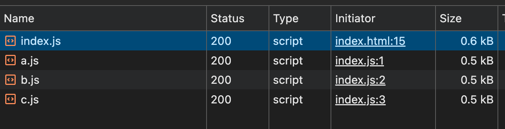
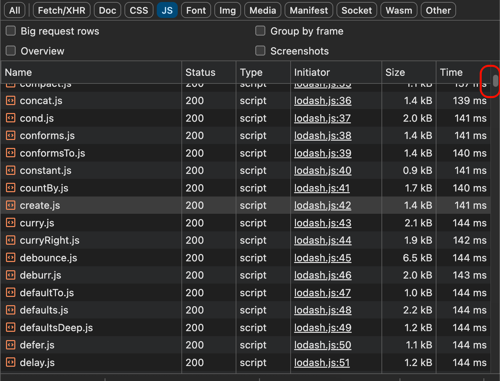
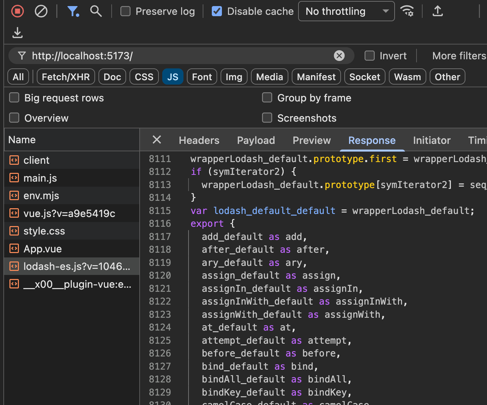
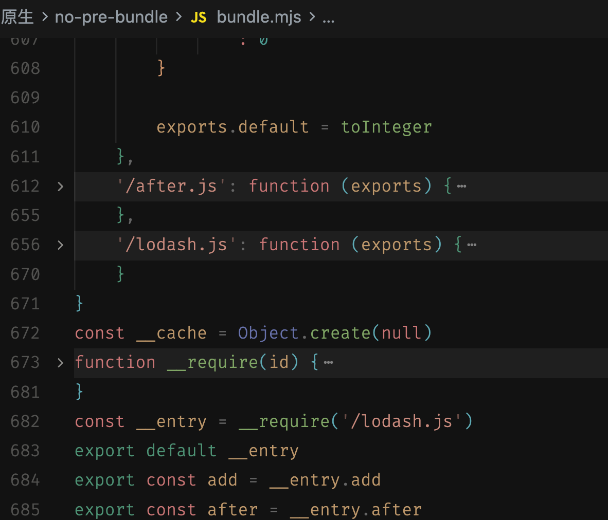

> 如果你用过 vite，那么想必对**依赖预构建**这一个名词并不陌生，本文就基于此来进行一些探讨。
>
> PS：本文分析来自于笔者的个人理解，如果发现了错误，可以在进行指正。当然说的是 vite 依赖于 esbuild 和 rollup 的时候，而非 rolldown。

## 为什么需要依赖预构建

> 通常如果要知道为什么需要一个东西，我们首要的前提就是知道“它解决了什么问题？”。这一点其实 vite 的文档已经给出了，主要是两个目的：**规范兼容性**和**性能**。

### 性能

我们知道，浏览器是可以通过给 script 标签添加 type="module" 来让其支持模块化的导入，所以，我简单写了一个 demo，demo 的结果如下：

```
依赖预构建
├── a.js
├── b.js
├── c.js
├── index.html
└── index.js
```

文件内容很简单，只要看一下 index.js 即可，如下：

```js
import { a } from './a.js'
import { b } from './b.js'
import { c } from './c.js'

console.log('index.js -- start')

a()
b()
c()

console.log('index.js -- end')
```

输出为：

```
index.js -- start
a.js:2 a.js
b.js:2 b.js
c.js:2 c.js
index.js:11 index.js -- end
```

好像一切都是岁月静好，但是其实它背后存在一个“负担”，我们来打开网络面板就可以看到了，如图：



三个导入就有三个请求，一个请求就是一个网络开销，而如果是一个成熟的第三方包，一个包就可能会有几十几百个文件的导入，这还是只是一个依赖，实际开发中，我们的项目是不会止步于一个依赖的。所以管中窥豹，就算再本地环境，这个网络开销也很难承受。

可能文字的描述还是略显苍白，那么让我们看一个引入 lodash 的例子，index.js 文件如下：

```js
// 因为这是浏览器环境，所以要知道精确的具体的 js 文件
import { toUpper } from './node_modules/lodash-es/lodash.js'

const msg = 'hello world'
console.log(toUpper(msg))

```

请求效果如图：



可以看到这个数量还是很恐怖的。而如果有依赖预构建呢？我们看一下请求的效果图：



可以看到，这个 lodash 请求数量都集中到一个文件，那么网络开销就少得多。而虽然这个文件的体积大很多，但是只需要进行一次网络的传输就可以了。这种大家可以尝试用一个较小的 node_modules 目录，进行复制传输或者打包压缩，它的时间比正常大文件的时间要多的多，

### 规范兼容性

性能问题解决了，但还有一个更棘手的问题在等着我们。

不知道你有没有想过，npm 上那些第三方包，它内部用的是什么模块规范？你不知道它是 commonjs 还是 esmodule。

而这就会导致一个比较尴尬的状况，我们来看一个例子，假设某个第三方包 `some-package` 内部是这样写的：

```js
// some-package/index.js
const helper = require('./helper.js')

module.exports = {
  doSomething() {
    return helper.process()
  }
}
```

当你在项目里 `import { doSomething } from 'some-package'` 的时候，你敢这么用，浏览器就敢来表演一下罢工，因为它压根不认识 `require` 和 `module.exports` 是啥。

所以就需要通过依赖预构建来解决这个问题，它会把这些 CommonJS 格式的代码转换成 ESM 格式，就像一个翻译官，把"方言"翻译成浏览器能听懂的"普通话"。转换后的代码大概如下：

```js
// 预构建后
import helper from './helper.js'

export function doSomething() {
  return helper.process()
}
```

## 最小实现

> 本文对于 esbuild 不会做出过多赘述，有兴趣的读者可以自己去查阅相关资料

### 分析

通过查看上文的一个截图，我们大概能看出，其实依赖预构建，就是吧 lodash 这个包的函数都打包到了一个文件里面，然后做了一个统一的导出，所以我们来实现的依赖预构建，也就是要完成这一个目标。

要完成这个目标如果采用比较原始的方式，莫过于在 node 中读取入口文件，根据导入的路径去读取文件的内容，写入到一个文件里面，最后添加一端统一的导出字符串。

这种想法好像一看没什么问题，但是其中还是有些问题的，比如入口文件导入的那个依赖文件，它内部还依赖了其他文件，如果只是粗暴的分析一个入口文件，最后的打包的单文件一定是不完整的，而其中还会存在重复的依赖引入，比如一些通用的工具函数，所以我们需要换一种思路。

我们聊的东西本质上就是：**如何从单一入口，递归地构建一个`依赖图`，并按依赖顺序读取所有模块内容**。因此大概执行的步骤如下：

```
1. 从入口文件的依赖开始，比如 from './add'
2. 再解析 add 内部的 import
3. 后续的依赖文件也执行这个逻辑
4. 直到最后没有新的依赖为止
```

生成**依赖图**，为什么是图而不是树呢？毕竟一想到递归，很多情况下大家不约而同的就想到了树结构，树结构如下：

```
# 树结构
entry
 ├─ a
 │   └─ shared
 └─ b
     └─ shared
```

那图结构有什么好处？

1. **一个模块可能被多个模块依赖（多父节点）**：这在真实项目里太常见了，工具函数、运行时垫片、第三方包内部的小工具……树结构天生表达不了“同一个东西被多处引用但只存在一份”。

   什么是多父节点，比如：

   ```
   A.js  ──┐
           ├──>  utils.js
   B.js  ──┘
   ```

   - `A.js` 里 `import utils from './utils.js'`

   - `B.js` 里 `import utils from './utils.js'`
   - 这个日常中很常见，于是 utils.js 就存在了两个父节点了，这就是多父节点
2. **循环依赖是存在的**：比如 `a` import `b`，`b` 又 import `a`。树要求“从上到下不能绕回来”，但依赖关系就是允许绕回来的，所以需要用图来描述，并且用“访问过就不再深入”的方式避免无限递归。

所以这里我们从一开始就用“依赖图”的视角去做：一边递归收集依赖，一边用绝对路径做去重，保证每个模块最多处理一次。
### 构建依赖图

因此第一步让我们来实现一个函数，给我一段文件源码字符串，在使用正则匹配出导入语句，如下：

```js
/**
 * 从文件内容中解析所有的 import/export from 语句，提取依赖路径
 */
function parseImports(content) {
    const imports = []

    // 匹配 import xxx from 'xxx' 或 export xxx from 'xxx'
    const importRegex =
        /(?:import|export)\s+(?:[^'"]*)\s+from\s+['"]([^'"]+)['"]/g

    let match
    while ((match = importRegex.exec(content)) !== null) {
        imports.push(match[1])
    }

    return imports
}

// 使用 lodash 的入口文件两个导入代码来做测试
const sourceCode = `export { default as add } from './add.js';
export { default as after } from './after.js';`
console.log(parseImports(sourceCode))
```

输入结果如下：

```
[ './add.js', './after.js' ]
```

那么下一步要做的事情就是，实现一个递归遍历函数，来反复执行这个过程，后面的代码就没什么特殊的，可以直接浏览一下相对完全的代码，如下：

```js
import fs from 'node:fs'
import path from 'node:path'

const entryFilePath = path.join(
    process.cwd(),
    './node_modules/lodash-es/lodash.js'
)

/**
 * 从文件内容中解析所有的 import/export from 语句，提取依赖路径
 */
function parseImports(content) {
    const imports = []

    // 匹配 import xxx from 'xxx' 或 export xxx from 'xxx'
    const importRegex =
        /(?:import|export)\s+(?:[^'"]*)\s+from\s+['"]([^'"]+)['"]/g

    let match
    while ((match = importRegex.exec(content)) !== null) {
        imports.push(match[1])
    }

    return imports
}

/**
 * 将相对路径解析为绝对路径
 */
function resolveModulePath(importPath, currentFilePath) {
    const currentDir = path.dirname(currentFilePath)
    return path.resolve(currentDir, importPath)
}

/**
 * 递归解析依赖，构建依赖图
 */
function buildDependencyGraph(entryPath) {
    // 依赖图
    const graph = new Map()
    // 已访问过的文件
    const visited = new Set()

    function traverse(filePath) {
        // 规范化路径
        const normalizedPath = path.normalize(filePath)

        // 已访问过则跳过
        if (visited.has(normalizedPath)) {
            return
        }

        visited.add(normalizedPath)

        // 读取文件内容
        let content
        try {
            content = fs.readFileSync(normalizedPath, 'utf-8')
        } catch (err) {
            console.error(`无法读取文件: ${normalizedPath}`)
            return
        }

        // 解析 import 语句
        const imports = parseImports(content)

        // 解析为绝对路径
        const dependencies = imports.map(imp =>
            resolveModulePath(imp, normalizedPath)
        )

        // 存入依赖图
        graph.set(normalizedPath, dependencies)

        // 递归处理每个依赖
        for (const dep of dependencies) {
            traverse(dep)
        }
    }

    traverse(entryPath)

    return graph
}

// 构建依赖图
const dependencyGraph = buildDependencyGraph(entryFilePath)

// 输出依赖图信息
console.log(`\n依赖图构建完成，共 ${dependencyGraph.size} 个模块\n`)

// 打印依赖图结构
for (const [file, deps] of dependencyGraph) {
    const relativePath = path.relative(process.cwd(), file)
    console.log(`+ ${relativePath}`)
    for (const dep of deps) {
        const relativeDepPath = path.relative(process.cwd(), dep)
        console.log(`   └── ${relativeDepPath}`)
    }
}
```

输出如下：

```
+ node_modules/lodash-es/lodash.js
   └── node_modules/lodash-es/add.js
   └── node_modules/lodash-es/after.js
+ node_modules/lodash-es/add.js
   └── node_modules/lodash-es/_createMathOperation.js
+ node_modules/lodash-es/_createMathOperation.js
   └── node_modules/lodash-es/_baseToNumber.js
   └── node_modules/lodash-es/_baseToString.js
+ node_modules/lodash-es/_baseToNumber.js
   └── node_modules/lodash-es/isSymbol.js
+ node_modules/lodash-es/isSymbol.js
   └── node_modules/lodash-es/_baseGetTag.js
   └── node_modules/lodash-es/isObjectLike.js
+ node_modules/lodash-es/_baseGetTag.js
   └── node_modules/lodash-es/_Symbol.js
   └── node_modules/lodash-es/_getRawTag.js
   └── node_modules/lodash-es/_objectToString.js
+ ...
```

有了这个依赖图之后，我们离这个核心就非常接近了，这个依赖图一眼看过去，都不知要如何遍历执行，所以我们还欠缺一个步骤，**拓扑排序**。

### 拓扑排序

如果按照上面依赖图区进行遍历读取，肯定会出现问题的，但是在实际的 bundle 中，就会爆炸，要得到正确的 bundle 就要做到 **所有模块按“依赖先、使用后”的顺序排好队**，而这个排队就是拓扑排序。

而实现的手段不做限制，毕竟在 ai 如此流行的情况，我相信 ai 可以写的很好很完善，还可以解释每一行代码的意义，我这里就直接贴出代码，如下：

```js
/**
 * 对依赖图做拓扑排序，返回“依赖在前、被依赖在后”的模块顺序
 */
function topologicalSort(graph) {
    const allNodes = new Set()

    for (const [filePath, deps] of graph) {
        allNodes.add(filePath)
        for (const dep of deps) {
            allNodes.add(dep)
        }
    }

    // indegree：一个模块还剩多少“依赖”没有被处理（依赖越多 indegree 越大）
    const indegree = new Map()
    // dependents：某个依赖被处理完后，哪些模块可以被推进
    const dependents = new Map()

    for (const node of allNodes) {
        indegree.set(node, 0)
        dependents.set(node, new Set())
    }

    for (const [filePath, deps] of graph) {
        for (const dep of deps) {
            if (!dependents.has(dep)) {
                dependents.set(dep, new Set())
            }
            dependents.get(dep).add(filePath)
            indegree.set(filePath, (indegree.get(filePath) ?? 0) + 1)
        }
    }

    const queue = []
    for (const node of allNodes) {
        if ((indegree.get(node) ?? 0) === 0) {
            queue.push(node)
        }
    }

    const sorted = []
    let idx = 0
    while (idx < queue.length) {
        const node = queue[idx++]
        sorted.push(node)

        const nextNodes = dependents.get(node)
        if (!nextNodes) continue

        for (const next of nextNodes) {
            const nextIn = (indegree.get(next) ?? 0) - 1
            indegree.set(next, nextIn)
            if (nextIn === 0) {
                queue.push(next)
            }
        }
    }

    if (sorted.length !== allNodes.size) {
        const cyclicNodes = []
        for (const [node, deg] of indegree) {
            if (deg > 0) cyclicNodes.push(node)
        }
        throw new Error(
            `检测到循环依赖，无法完成拓扑排序：\n${cyclicNodes.join('\n')}`
        )
    }

    return sorted
}
```

结果如下：

```
[
  // ...
  '/Users/coderjc/Documents/test-code/原生/no-pre-bundle/node_modules/lodash-es/_baseGetTag.js',
  '/Users/coderjc/Documents/test-code/原生/no-pre-bundle/node_modules/lodash-es/isSymbol.js',
  '/Users/coderjc/Documents/test-code/原生/no-pre-bundle/node_modules/lodash-es/_baseToNumber.js',
  '/Users/coderjc/Documents/test-code/原生/no-pre-bundle/node_modules/lodash-es/_baseToString.js',
  '/Users/coderjc/Documents/test-code/原生/no-pre-bundle/node_modules/lodash-es/toNumber.js',
  '/Users/coderjc/Documents/test-code/原生/no-pre-bundle/node_modules/lodash-es/_createMathOperation.js',
  '/Users/coderjc/Documents/test-code/原生/no-pre-bundle/node_modules/lodash-es/toFinite.js',
  '/Users/coderjc/Documents/test-code/原生/no-pre-bundle/node_modules/lodash-es/add.js',
  '/Users/coderjc/Documents/test-code/原生/no-pre-bundle/node_modules/lodash-es/toInteger.js',
  '/Users/coderjc/Documents/test-code/原生/no-pre-bundle/node_modules/lodash-es/after.js',
  '/Users/coderjc/Documents/test-code/原生/no-pre-bundle/node_modules/lodash-es/lodash.js'
]
```

我们的例子中为了更好的观察，只保留了 add 和 after 两个函数的导入，从结果来看，是没什么问题的。

后续的步骤大概可以拆分为两步，一步是源码转换，一步是 bundle 生成，这一步其实比较简单，因为我们可以直接利用 esbuild 来完成。

当然也可以自己写，不过我是直接丢给 ai 实现，大概的结果如图：



### 使用 esbuild 完成构建

其实利用 esbuild 都不需要我们去自己实现依赖图什么的，只是为了说明大概做了什么事情而写的，下面看看使用 esbuild 如何实现。如下：

```js
import esbuild from 'esbuild'

export async function prebundleDeps(deps) {
    await Promise.all(
        deps.map(dep => {
            return esbuild.build({
                entryPoints: [dep],
                bundle: true,
                format: 'esm',
                platform: 'browser',
                outfile: './dist/lodash-es.js',
                sourcemap: true
            })
        })
    )
}

prebundleDeps(['lodash-es'])
```

打包结果如图：


大家可以和前文的网络请求的文件截图对比一下，结果都是一致的。


